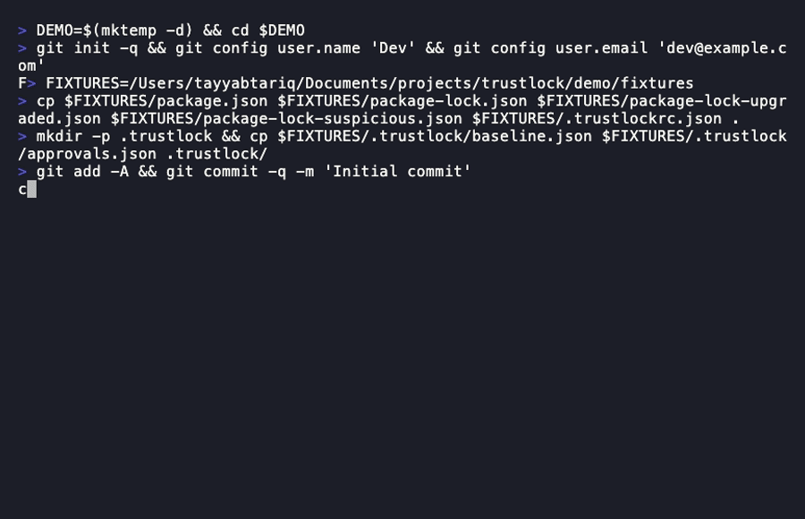

# trustlock

[](https://www.npmjs.com/package/trustlock)
[](LICENSE)

A Git-native dependency admission controller. Evaluates trust signals on every dependency change.



## How it works

trustlock runs as a **Git pre-commit hook** (advisory mode) and a **CI check** (enforce mode):

- **Advisory (pre-commit):** warns on violations, exits 0, advances the trusted baseline when all packages are admitted.
- **Enforce (`--enforce`):** blocks on violations, exits 1, never advances the baseline.

Trust signals evaluated per-package:
- **Cooldown** — how long since the version was published to the registry
- **Provenance** — whether the package has SLSA attestations
- **Pinning** — whether the lockfile uses exact versions
- **Install scripts** — whether the package runs install-time scripts
- **Sources** — whether the package comes from the registry, a git URL, a local path, or a URL
- **New dependencies** — first-time additions to the project
- **Transitive surprise** — unexpected jump in transitive dependency count
- **Publisher change** — whether the package's publisher identity changed between versions

## Installation

```bash
npm install -g trustlock
```

Requires Node.js >= 18.3.

## Supported lockfiles

| Lockfile | Ecosystem | Versions |
|----------|-----------|---------|
| `package-lock.json` | npm | v1, v2, v3 |
| `pnpm-lock.yaml` | pnpm | v5, v6, v9 |
| `yarn.lock` | yarn | classic (v1), berry (v2/v3) |
| `requirements.txt` | Python (pip) | — |
| `uv.lock` | Python (uv) | — |

## Quick start

### Workflow 1 — Onboarding a project

```bash
# 1. Initialize trustlock in your project
trustlock init

# 2. Install the Git pre-commit hook
trustlock install-hook

# 3. Optionally review your current dependency posture
trustlock audit
```

After `init`, trustlock creates:
- `.trustlockrc.json` — policy configuration
- `.trustlock/baseline.json` — trusted dependency snapshot
- `.trustlock/approvals.json` — approval records
- `.trustlock/.cache/` — registry cache (gitignored)

Commit `.trustlockrc.json` and `.trustlock/baseline.json` to your repository.

### Workflow 2 — Check and admit a dependency update

```bash
# Run dep install as normal
npm install lodash@4.17.21

# trustlock check runs automatically via the pre-commit hook.
# To run it manually:
trustlock check

# Output when all packages are admitted:
# ✔ lodash@4.17.21 — admitted
```

When all packages pass, `trustlock check` advances the baseline automatically (advisory mode only) and exits 0.

### Workflow 3 — Handle a blocked dependency

```bash
# A new package fails the cooldown rule:
trustlock check
# ✖ new-hotness@1.0.0 — blocked
#   exposure:cooldown  Published 2h ago (policy requires 72h)
#   Run to approve: trustlock approve new-hotness@1.0.0 --override cooldown --reason "..." --expires 7d

# Approve the override, then re-check:
trustlock approve new-hotness@1.0.0 \
  --override cooldown \
  --reason "Needed for feature X; verified safe by team review" \
  --expires 7d

trustlock check
# ✔ new-hotness@1.0.0 — admitted with approval
```

### Workflow 4 — Compare dependency posture across projects

```bash
# Detect version drift and provenance inconsistencies across monorepo packages
trustlock audit --compare packages/frontend packages/backend packages/shared
```

## Commands

| Command | Description |
|---|---|
| `trustlock init` | Initialize trustlock in the current project |
| `trustlock check` | Evaluate dependency changes against policy |
| `trustlock approve <pkg>@<ver>` | Approve a blocked package |
| `trustlock audit` | Scan the full dependency tree for trust posture |
| `trustlock audit --compare <dir...>` | Compare dependency posture across multiple projects |
| `trustlock clean-approvals` | Remove expired approval entries |
| `trustlock install-hook` | Install the Git pre-commit hook |

## Policy profiles

trustlock ships two built-in profiles selectable with `--profile`:

| Profile | Effect |
|---------|--------|
| `strict` | 168h cooldown, provenance required for all packages |
| `relaxed` | 24h cooldown, no block on provenance regression or publisher change |

```bash
# Use strict profile in CI
trustlock check --enforce --profile strict
```

## Org policy inheritance

Teams can centralize policy in a shared URL and extend it per repo:

```json
{
  "extends": "https://policy.example.com/trustlockrc.json",
  "cooldown_hours": 96
}
```

Repo configs can only tighten org policy — floor enforcement prevents repos from reducing org-mandated thresholds.

## Documentation

- [USAGE.md](USAGE.md) — Full command reference, all flags, exit codes, error messages
- [POLICY-REFERENCE.md](POLICY-REFERENCE.md) — Every `.trustlockrc.json` option
- [ARCHITECTURE.md](ARCHITECTURE.md) — Design decisions and module map
- [examples/](examples/) — Config and CI workflow examples

## CI integration

Add trustlock to your CI pipeline:

```yaml
# GitHub Actions — see examples/ci/github-actions.yml
- run: npx trustlock check --enforce
```

See [`examples/`](examples/) for GitHub Actions, Lefthook, and Husky configurations.

## What trustlock does NOT do

- **Not a malware scanner** — trustlock does not inspect package source code or detect known-malicious signatures. Use a dedicated scanner for that.
- **Not a CVE tracker** — use `npm audit` or Snyk for vulnerability databases.
- **Not a license checker** — use `license-checker` or similar.
- **Not a replacement for pnpm trustPolicy or npm's min-release-age** — those are server-side controls enforced by the registry. trustlock is a client-side admission gate at the repo boundary.

## About

trustlock was built out of frustration with how passive the standard Node.js toolchain is about what actually gets pulled into a project. `npm install` will fetch anything — a package published two minutes ago, one that runs arbitrary scripts at install time, one that swapped from a registry tarball to a git URL overnight — and the only feedback you get is a lockfile diff.

The threat model trustlock addresses is narrow but real: the window between when a malicious version is published and when it is pulled or flagged. Vulnerability scanners operate after the fact. trustlock operates at the admission point, before anything lands in your repo or your CI.

The design is intentionally minimal. trustlock has no runtime dependencies — it is itself a zero-supply-chain-risk tool. It does not replace a vulnerability scanner or a dependency audit; it enforces trust continuity. Once a version is in your baseline, it is trusted. Anything new has to earn admission against the policy you declare.

The approval workflow exists for teams that need an escape hatch without losing auditability. Every override is timestamped, scoped to specific rules, and expires. `clean-approvals` is a first-class command, not an afterthought.
